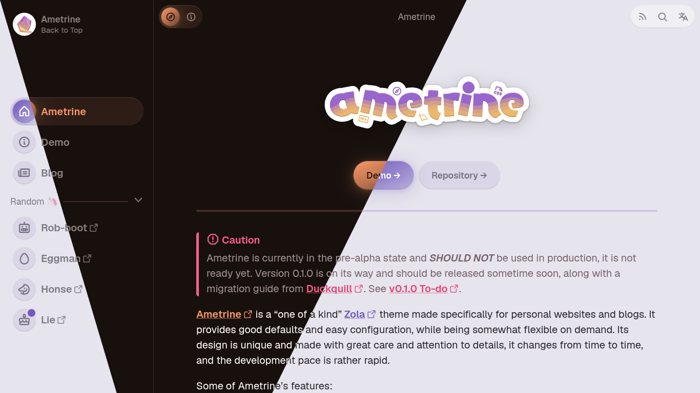

# [Ametrine](https://ametrine.daudix.one)

> [!CAUTION]
> Ametrine is currently in the pre-alpha state and ***SHOULD NOT*** be used in production, it is not ready yet. Version 0.1.0 is on its way and should be released sometime soon, along with a migration guide from [Duckquill](https://duckquill.daudix.one). See [v0.1.0 To-do](https://codeberg.org/Geode/ametrine/issues/3).

[Zola](https://www.getzola.org) theme made specifically for personal websites and blogs. It provides good defaults and an easy configuration, while being somewhat flexible on demand. Its design is rather unique and changes from time to time, and the development pace is rather rapid.

## Docs

Docs are provided in a form of [live demo](https://ametrine.daudix.one).

## Know your rights

This website is under the MIT license:

- **Freedom to Use**: You have the right to use the software for any purpose, whether it's personal, academic, or commercial.
- **Freedom to Modify**: You can modify the source code of the software to suit your needs or preferences.
- **Freedom to Distribute**: You have the right to distribute the software, whether in its original form or modified, to others.
- **Collaboration**: You can collaborate with others on the software's development and improvement.
- **No License Compatibility Issues**: You can combine the MIT-licensed software with other software, even if they use different licenses.
- **No Usage Restrictions**: There are no restrictions on the technologies or fields of use, giving you maximum flexibility.
- **No Royalties**: You are not required to pay any royalties or fees for using, modifying, or distributing the software.

## Contributing guidelines

There are several ways to contribute to this project:

- Reporting issues
- Discussing potential improvements
- Contributing code
- Writing documentation
- Submitting feature requests
- Providing feedback

When making any sort of contribution, please make sure to follow [Forgejo's Code of Conduct](https://codeberg.org/forgejo/code-of-conduct). If you don't have the time to read it, just know that all you have to do is be nice, and you'll be just fine.

*</> with <3 by [daudix](https://daudix.one) | README based on [libreivan's](https://codeberg.org/libreivan/libreivan.com)*
